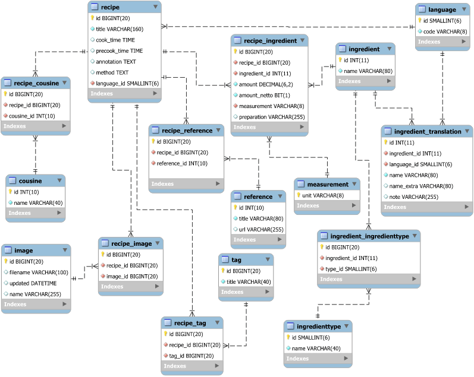

[](https://travis-ci.org/fankandin/cooking-app-endpoint)

# Cooking App RESTful API backend

**Cooking App** is a microservice based application to serve as a household database of recipes. This repository is the RESTful backend component, which is planned to serve to the database Admin GUI and (in the future) the client apps (for listing and search recipes).
 
This application is written on _Java 8_ and uses _Spring Boot_, _Hibernate_. The build automation is handled by _Maven_. The database migrations are managed by means of [Liquibase](http://www.liquibase.org/).

This backend has a fully-functional frontend GUI application: [Cooking App Admin](https://github.com/fankandin/cooking-app-admin). The complete fully-containerized build can be found [here](https://github.com/fankandin/cooking-app-containerized).

## How to launch the application

### Out-of-box containerized build
Use this [Cooking App Containerized](https://github.com/fankandin/cooking-app-containerized) repository to run a fully-functional demo in 1 click. The present API backend app is one of the containers there.

### Native run
First build the app with maven:
```
mvn package
```
then launch the jar artifact:
```bash
java -jar ./app/target/cooking-app-api-1.0.0.jar --spring.config.location=/path/to/env.properties --spring.profiles.active=production
```
The _env.properties_ (you are free to use any file name) file contains the settings like database credentials, etc. You may find details below. 

### Docker
```bash
docker create --name cooking-api-endpoint --link mysql -p 8800:8800 vintagedreamer/cooking-api-endpoint:latest
docker cp /path/to/db.properties cooking-api-endpoint:/app/configuration/db.properties
docker start cooking-api-endpoint
```

## Configuration
This is the mininum list of required parameters (with sample values) you should to provide to the application:
```
db.driverClassName=com.mysql.jdbc.Driver
hibernate.dialect=org.hibernate.dialect.MySQL5Dialect
db.url=jdbc:mysql://dbhost:3306/cooking?characterEncoding=UTF-8&autoReconnect=true&useSSL=false
db.username=db_user
db.password=db_pass
spring.cors.origins=*
hibernate.hbm2ddl.auto=validate
```
This sample can also be found in the _env.properties.dist_ file supplied with this repository.

## Swagger
The app contains built-in [Swagger](http://swagger.io/) - a very handy tool for testing and documenting the API.
 * Swagger UI: <http://localhost:8800/swagger-ui.html>
 * Swagger 2.0 API documentation: <http://localhost:8800/v2/api-docs>

## Database structure

The database is designed with perspective. Not all the entities are maintained by application yet. Use Swagger UI (see above) to see the list of available endpoints.    

## Copyrights
This application is developed by <a href="http://palamarchuk.info/">Alexander Palamachuk</a>.
